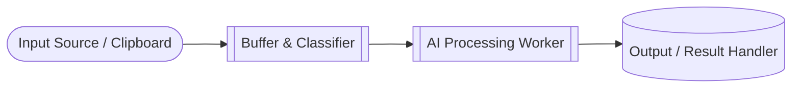

# DSTranslator

Backend de un **pipeline de procesamiento de texto asistido por IA**, diseñado para manejar contenido estructurado y secuencial de forma confiable.  
El sistema se enfoca en **preservar el orden del contenido**, **evitar pérdida de información** y **controlar el envío de texto a modelos de lenguaje** mediante buffering, batching y validaciones determinísticas.

Actualmente el repositorio contiene **únicamente la lógica de backend**. Componentes de interfaz u overlays podrán incorporarse en etapas posteriores.

---

## 🧠 Descripción General

DSTranslator implementa un flujo de procesamiento orientado a texto continuo, donde cada entrada es clasificada (trivial, corta o larga) para decidir su estrategia de envío y procesamiento.  
La IA se utiliza como apoyo dentro del pipeline, mientras que la **orquestación, control de errores y consistencia** son responsabilidad del backend.

El diseño es aplicable a múltiples escenarios como **procesamiento narrativo, análisis de logs, localización de contenido o flujos secuenciales de texto**.

---

## ⚙️ Características Principales

- Clasificación de entradas triviales, cortas y largas
- Buffering y batching controlado para optimizar requests a LLMs
- Prevención de pérdida de texto y duplicados
- Preservación del orden lógico del contenido
- Integración de IA de forma segura y controlada
- Arquitectura backend desacoplada y extensible

---

## 🧰 Tecnologías Utilizadas

| Capa | Tecnología |
|------|------------|
| Lenguaje | Python |
| Procesamiento | AsyncIO, colas y buffers en memoria |
| IA | Integración con APIs de LLMs (ChatGPT, DeepSeek) |
| Utilidades | Regex, clipboard listener |
| Arquitectura | Backend modular, pipeline orientado a eventos |

---

## 🧱 Arquitectura General

---

## 👨‍💻 Autor

**Alexis Córdova Díaz**  
Analista Programador | Desarrollador Full Stack  
📧 alexisandres311@gmail.com  
🌐 [linkedin.com/in/alexis-andres-cordova](https://linkedin.com/in/alexis-andres-cordova)

---
